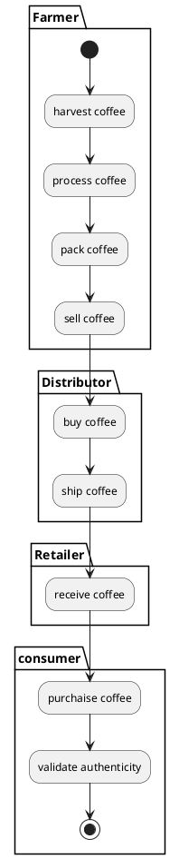
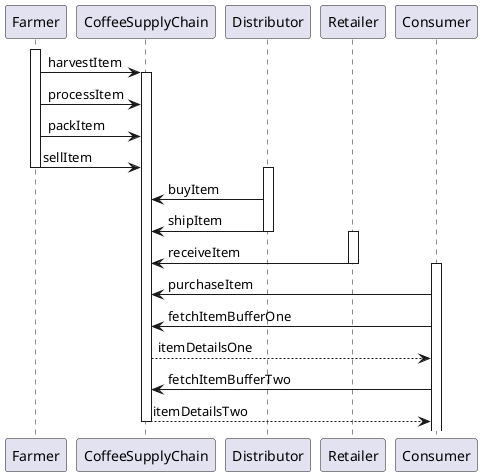
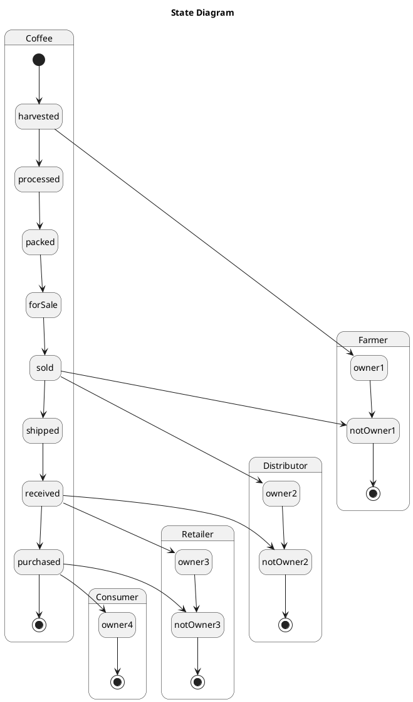
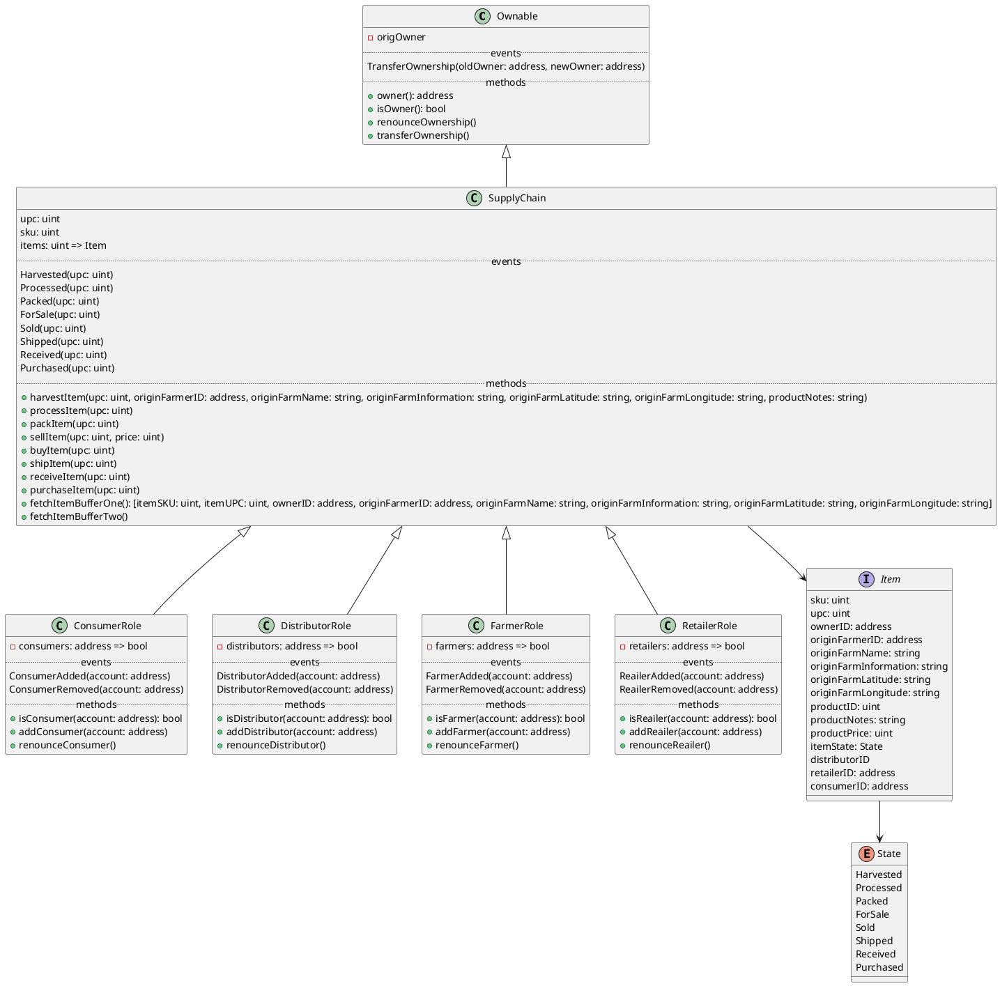

# UML Diagrams

If you are using vscode you can use the [Markdown Plantuml Preview](https://marketplace.visualstudio.com/items?itemName=myml.vscode-markdown-plantuml-preview) plugin to preview this .md file with rendered PlantUML diagrams.

You can also paste the PlantUML codes to http://www.plantuml.com/plantuml/uml/

## Activity Diagram

## Sequence Diagram

## State Diagram

## Class Diagram

